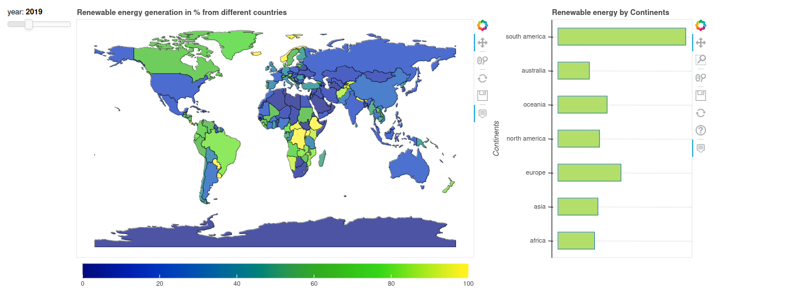

# Mapping the world Renewable energy contribution

Renewable energy continues to evolve rapidly, driven by technological innovation, market forces, and a growing awareness of the need for sustainable energy solutions. As developments progress, the renewable energy sector plays a pivotal role in shaping a cleaner and more resilient global energy landscape.

The map explores the total capacity and generation of renewable energy by each country around the world.

**Source**: IRENA Renewable Energy Statistics 2021

**Python version**: 3.9.12

# Research

At present the world generates about 25% energy through renewable sources. When considering the generation of energy by continents South America has been able to successfully replace fossil fuels by 69% and is the only continent to have above 50% production. Some of the countries that have shown exceptional developments in Renewable Energy Generation are as follows:

**China** -

Although the contribution of renewable energy generated is only 25% of the total generated energy, the amount they produce is the highest of all. Producing upto 20 lakh+ Gigawatt-hour annually, China is the top in the list. To achieve greater success, the organization

**Norway** -

Norway is the top country in Europe that produced over 1 lakh+ Gigawatt-hour and covers about 98% of the total energy generated. It is the ideal country that provides 

**India** -

India's growing economy has been the talk of the century and the power it generates to run its industry is substantial. The amount of renewable energy now it generates is only 18% of the total energy

**Brazil** -

Brazil's renewable energy generation story is characterized by a diverse mix of sources, with a historical emphasis on hydropower. The country has large-scale hydropower projects like the Itaipu Dam, a global leader in bioethanol production, a growing wind energy sector along its coastline, and an expanding solar power industry. Government policies, incentives, and auctions have stimulated renewable energy development, aligning with Brazil's goals of energy independence and security. Challenges include environmental considerations and the need for sustainable practices. Brazil's commitment to sustainability and ongoing efforts in research and development position it as a significant player in the global shift toward cleaner and more resilient energy systems.

**Ethiopia** - 

The Government of Ethiopia (GOE) has focused on the construction and expansion of power generating projects to deliver reliable electricity. Approximately 90% of the installed generation capacity is from hydropower while the remaining 8% and 2% is from wind and thermal sources, respectively.

Ethiopia's journey in renewable energy production stands as a beacon of inspiration for nations seeking to balance energy needs with environmental stewardship. By harnessing the power of its abundant water resources and embracing the wind that sweeps across its highlands, Ethiopia has not 
only transformed its energy landscape but has also paved the way for a brighter and more sustainable future. As the nation continues to navigate the challenges of the evolving energy sector, Ethiopia serves as a testament to the transformative potential of renewable energy in driving inclusive development and fostering environmental resilience.

| Source | Generated | Percentage |
|--------|-----------|------------|
| Total | 15817.32 | 100 |
| Solar | 33.89 | 0.21 |
| Wind | 817.20 | 5.17 |
| Hydro | 14942.83 | 94.47 |

**Canada**

In the developed countries categorty, Canada is one of the few and the only one in North America that generates more than 50% renewable energy annually. While the production in Gigawatt-hour is only about 400k

| Source | Generated | Percentage |
|--------|-----------|------------|
| Total | 433680 | 100 |
| Solar | 6043 | 1.39 |
| Wind | 34753 | 8.01 |
| Hydro | 382867 | 88.26 |

## Comparing regions

**Middle East and North Africa**

The oil rich region has been the lowest producer of renewable energy in the world,

**South America**

This region is concious of the means of energy generation, considering they produce about 70% energy through renewable means. Brazil is the largest energy generator in the region and has utilized its resources to its maximum. 
